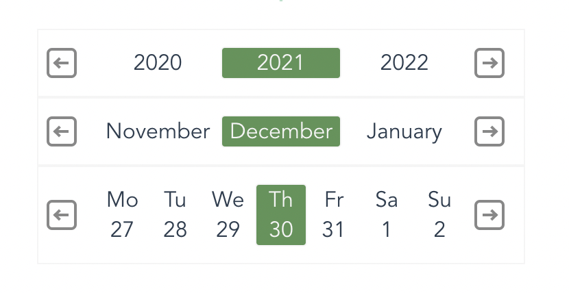

# vue2-week-calendar

> A Week (years, days) Component For Vue2
<a href="https://www.npmjs.com/package/vue2-week-calendar">
  
</a>
<a href="LICENSE">
  
</a>

## Example


## Install

```bash
$ npm install vue2-week-calendar --save
```

## Usage

```html
<script>
  import WeekCalendar from 'vue2-week-calendar';
  export default {
    components: { WeekCalendar },
    data() {
      return {
        time1: new Date(),
      };
    },
  };
</script>

<template>
  <div>
    <WeekCalendar v-model="time1"></WeekCalendar>
  </div>
</template>
```

### Slots

| Name          | Description              |
| ------------- | ------------------------ |
| months        | custom months template   |
| years         | custom years template    |
| days          | custom days template     |

```html
<WeekCalendar v-model="time1">
  <template v-slot:years="{ years, next, prev, isEqual, change }">
    {{ years }}
    {{ isEqual(mydate, years[0]) }}
    <button @click="prev">Prev</button>
    <button @click="next">Next</button>
    <button @click="() => change(years[0])">Change 0 index</button>
  </template>

  <template v-slot:months="{ months, next, prev, isEqual, change }">
    {{ months }}
    {{ isEqual(mydate, months[0]) }}
    <button @click="prev">Prev</button>
    <button @click="next">Next</button>
    <button @click="() => change(months[0])">Change 0 index</button>
  </template>

  <template v-slot:days="{ days, next, prev, isEqual, change }">
    {{ days }}
    {{ isEqual(mydate, days[0]) }}
    <button @click="prev">Prev</button>
    <button @click="next">Next</button>
    <button @click="() => change(days[0])">Change 0 index</button>
  </template>
</WeekCalendar>
```

<!-- ## ChangeLog (coming soon)

[CHANGELOG](CHANGELOG.md) -->

<!-- ## One-time Donations

If you find this project useful, you can buy me a coffee

[Paypal Me](https://www.paypal.me/)

 -->

<!-- ## License

[MIT](https://github.com/Inaztm/vue2-week-calendar/blob/main/LICENSE)

Copyright (c) 2021-present inaztm -->

## Dev

## Project setup
```
yarn install
```

### Compiles and hot-reloads for development
```
yarn serve
```

### Compiles and minifies for production
```
yarn build
```

### Compiles and minifies for production library
```
yarn build-lib
```

### Run your unit tests
```
yarn test:unit
```

### Lints and fixes files
```
yarn lint
```
